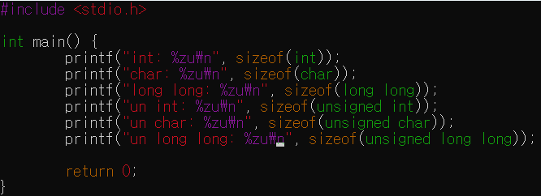
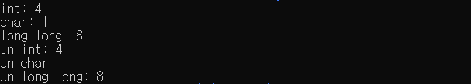
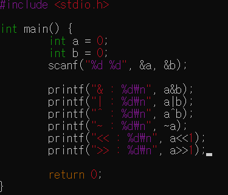
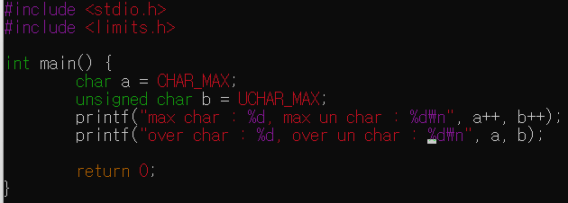

challenge1  
  
  
각각의 바이트 크기를 나타내고 8비트가 1바이트이므로 int의 경우 32바이트를 할당한다고 볼 수 있다.

challenge2  
  
  
a:2(10) -> 10(2)
b:3(10) -> 11(2)

AND:10  
OR:11  
XOR:01  
NOT:01(-부호)  
<<:100  
">>":1  

challenge3  
  
  
char:[-128,127]
unsigned char:[0,255]
오버플로우 시 부호를 결정하는 메모리 변화 -> 부호 변화 + 최소값
unsigned의 경우 변화해도 0
