challenge1  
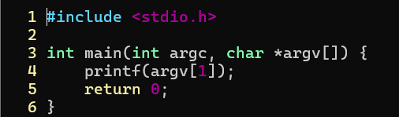  
결과  
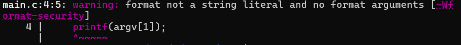  
포멧 스트링을 쓰지않은 경우 기본적으로 경고를 해주는 모습을 볼 수 있다. 
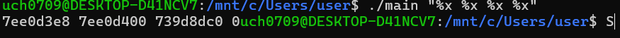  
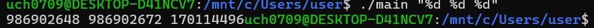  
기본적으로 printf는 "포멧", 값 형식으로 구성되어야 정상이지만 포멧이 존재하지않으면 그냥 존재하는 값들(스택주소, 코드영역주소, 라이브러리주소, 쓰레기값등)을 실제 값처럼 가져온다.  
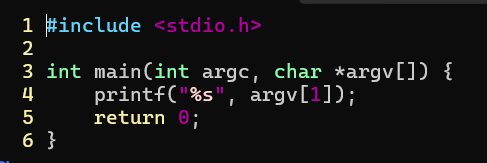  
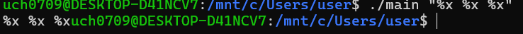  
포멧을 넣어서 다시 실행하면 정상적으로 입력한 값이 출력된다.  

challenge2  
for:반복횟수를 지정해주기 좋음  
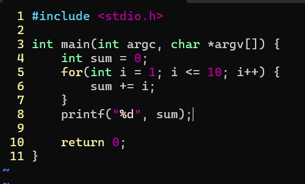  
while:조건을 지정해주기 좋음  
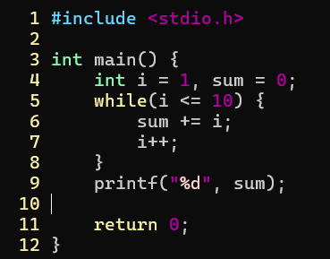  
do while:while을 실행하기전에 무조건 한 번 실행  
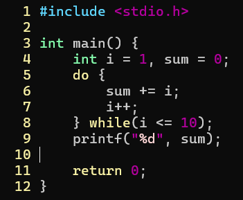  
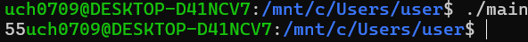  
결과는 모두 같다.  

challenge3  
삼항연산자에 경우 코드를 줄일 수 있는 장점이 있지만 가독성이 떨어지고  
switch에 경우 직접적인 대소 비교가 안되기 때문에 case에 따라 정수로 변환을 해줘야한다.  
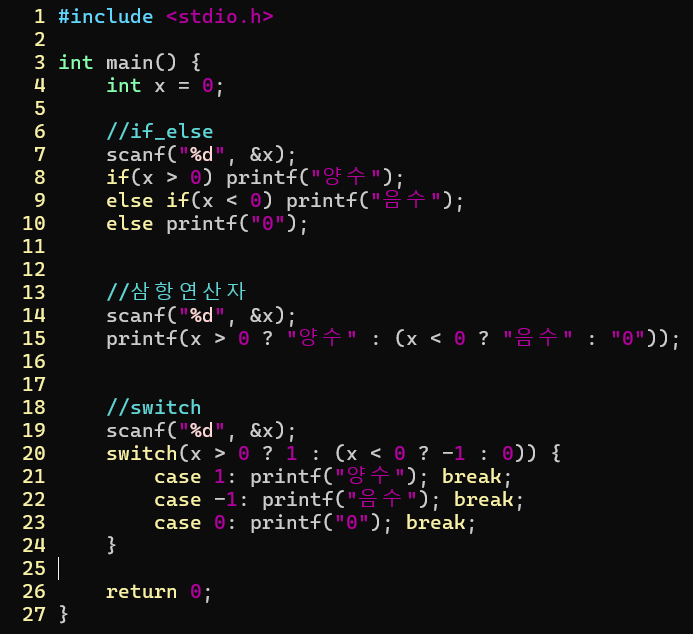  
결과  
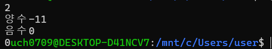  

challenge4  
gdb에 경우 코드의 실행과정을 조절할 수 있어서 실행 중 변수 값을 확인하기 좋고  
레지스터나 메모리 구조도 확인 가능하다.  
break:함수 시작 멈춤  
run:실행  
next:다음 한 줄 실행  
step:함수 내부  
print:변수 출력  
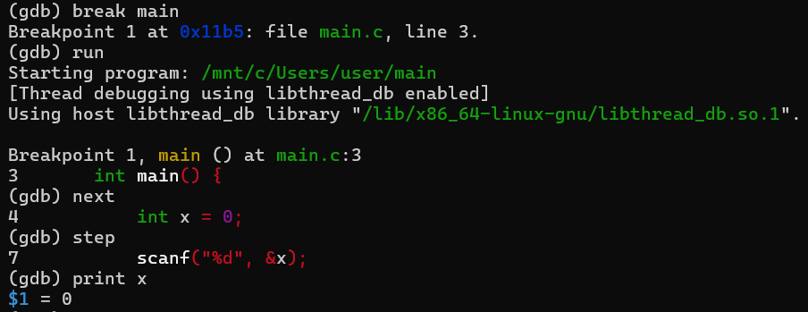  
info registers:레지스터 보기  
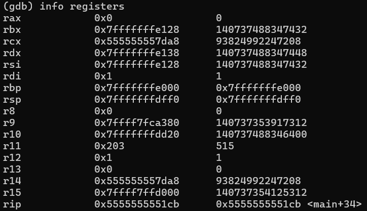  
x:메모리 확인(x/진수 $위치)  
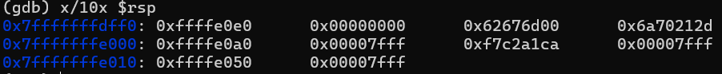  
