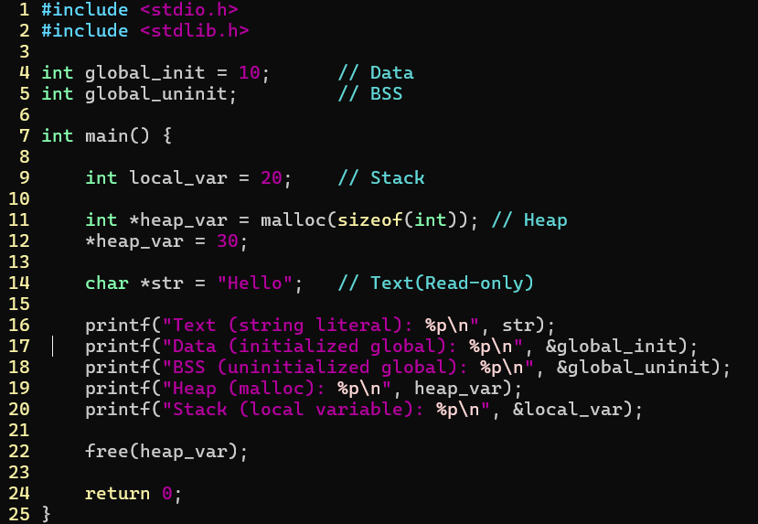
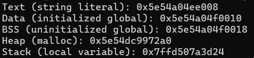
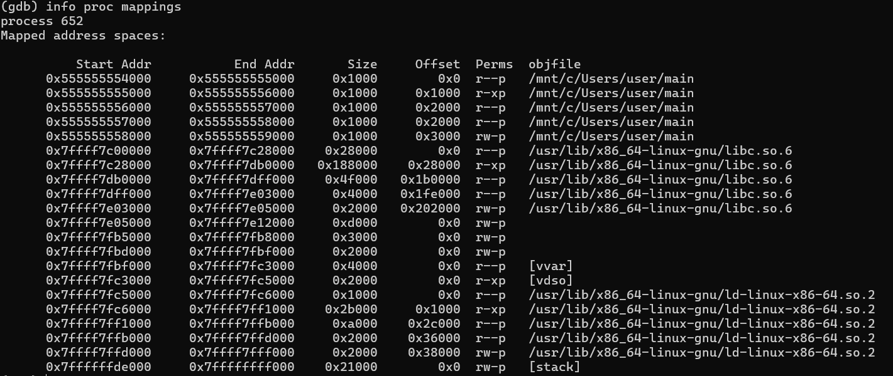
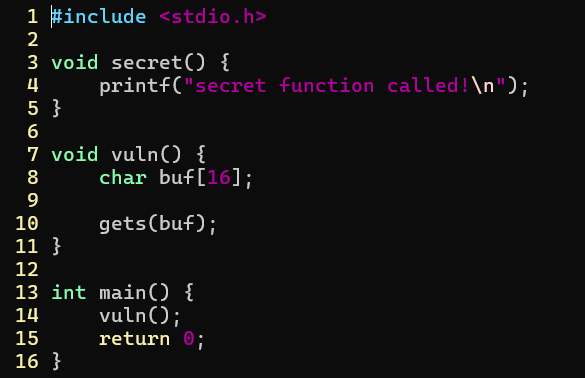
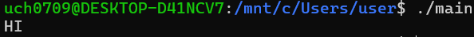
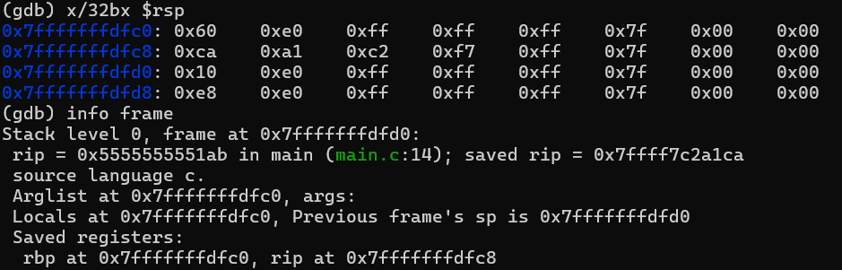
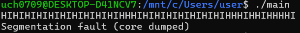
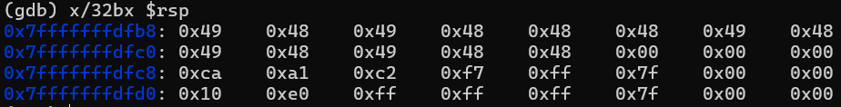

challenge1  
프로그램 메모리 구성↓  
높은 주소
-----------------
Stack
-----------------
Heap
-----------------
BSS 
Data 
Text(Code)
-----------------
낮은 주소
-

| 영역    | 저장되는 것       |
| ----- | ------------ |
| Text  | 코드, 문자열 리터럴  |
| Data  | 초기화된 전역변수    |
| BSS   | 초기화 안 된 전역변수 |
| Heap  | malloc()     |
| Stack | 지역변수         |  

  
 실행 결과  
 메모리 맵 확인  
스택에 경우 메모리 주소가 0x7ffd507a3d24로 할당되었는데 메모리 맵에서 0x7ff...으로 시작하는 주소는 스택이므로 알맞은 위치로 할당되었다.  

challenge2  
BOF  
  
 결과에 문제가 없다.   
 ret address도 정상적인 주소값이 들어가있다.  
 오버플로우가 되면서 세그먼트 에러가 뜬다.  
 ret address가 0x49, 0x48로 덮어졌다. (0x49, 0x48은 I, H를 의미함)  

| 함수          | 이유         |
| ----------- | ------------| 
| gets        | 길이 제한 없음  |
| strcpy      | 크기 검사 없음 |
| strcat      | 이어붙임 overflow |
| scanf("%s") | 길이 제한 없음 |

