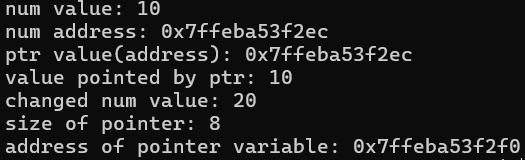
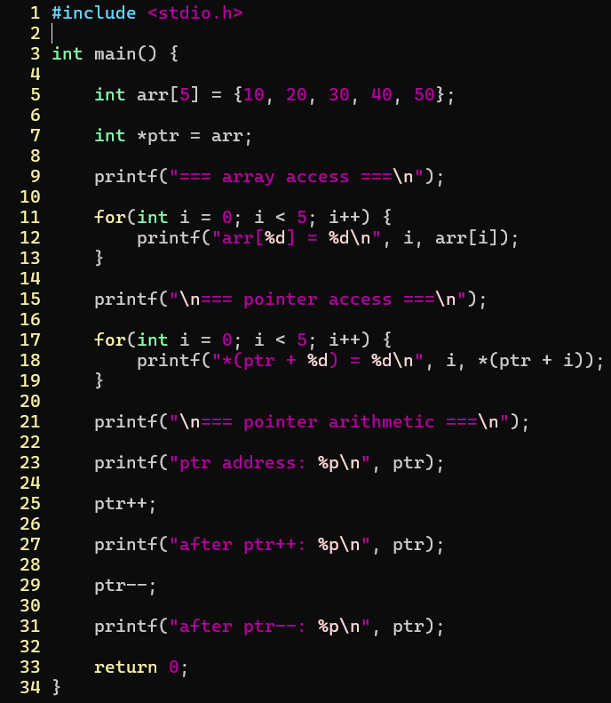
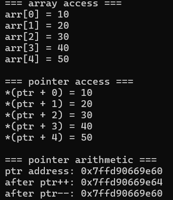
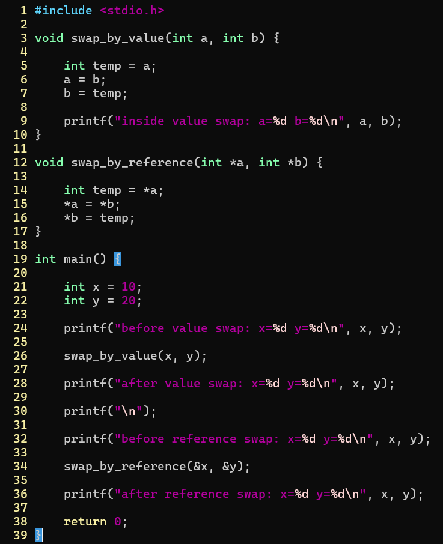
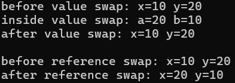

challenge1  
  
  
| 명령어 | 내용 |
| ------ | - |
| &num   | 변수의 주소 할당 |
| *ptr   | 포인터 주소 값 |

포인터 변수 크기 = 주소 크기  

challenge2  
  
  
c에서는 리스트가 없고 배열만 존재함 = 배열 속 원소들이 순서대로 메모리에 할당됨  
배열 자체는 배열 첫번째 원소에 주소를 가져옴 따라서 자료형 크기를 알면 원하는 인덱스에 접근할 수 있음  

challenge3  
  
  
값 자체만 변화 vs 주소 변화
