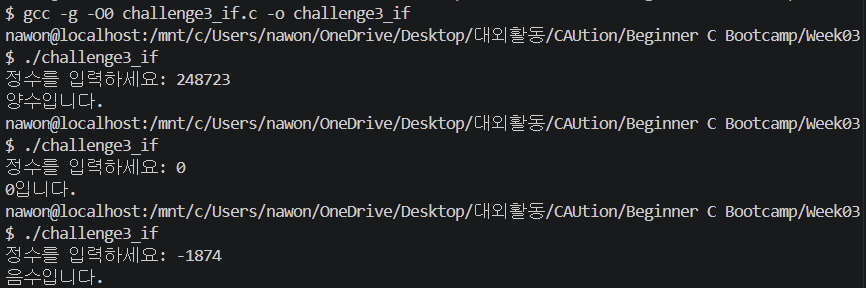

# Challenge3. 조건문으로 분기 구현

#### 문제

- 사용자로부터 정수를 입력받아 양수/음수/0을 판별하는 프로그램 작성
- if문, 삼항 연산자 ?:, switch 등 다
- 추가로 동일한 동작을 switch문으로도 구현해보기

#### 풀이

1. 코드 작성
    - if문
        
        ```bash
        #include <stdio.h>
        
        int main() {
            int num;
            printf("정수를 입력하세요: ");
            scanf("%d", &num);
        
            // 1. if문
            if (num > 0) {
                printf("양수입니다.\n");
            } else if (num < 0) {
                printf("음수입니다.\n");
            } else {
                printf("0입니다.\n");
            }
        
            return 0;
        }
        ```
        
        
        
    - 삼항 연산자
        
        ```bash
        #include <stdio.h>
        
        int main() {
            int num;
            printf("정수를 입력하세요: ");
            scanf("%d", &num);
        
            // 2. 삼항 연산자
            printf("%s\n", (num > 0) ? "양수입니다." : ((num < 0) ? "음수입니다." : "0입니다."));
        
            return 0;
        }
        ```
        
        
        
    - switch문
        
        ```bash
        #include <stdio.h>
        
        int main() {
            int num;
            printf("정수를 입력하세요: ");
            scanf("%d", &num);
        
            // 3. switch문
            // (num > 0)은 참이면 1, 거짓이면 0을 반환
            int condition = (num > 0) - (num < 0); 
            
            switch (condition) {
                case 1:
                    printf("양수입니다.\n");
                    break;
                case -1:
                    printf("음수입니다.\n");
                    break;
                case 0:
                    printf("0입니다.\n");
                    break;
            }
        
            return 0;
        }
        ```
        
        