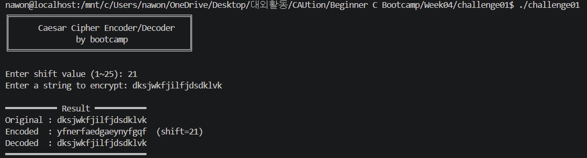

# Challenge1. 함수 작성 및 호출 구조 이해

#### 문제

- 함수를 직접 작성하고 호출해보는 challenge
- 시저 암호 인코더/디코더
    - void print_banner - 프로그램 배너 출력
    - void encode(char *str, int shift) - 문자열을 shift만큼 밀어서 암호화
    - int get_shift() — 사용자로부터 shift 값 입력받아 반환
- 함수를 왜 쓰는지, 어떤 상황에서 유용한지 간단히 정리

#### 풀이

- 작성한 코드
    
    ```c
    #include <stdio.h>
    #include <string.h>
    #include <ctype.h>
    
    // 1. 프로그램 배너 출력
    void print_banner(void)
    {
        printf("╔══════════════════════════════════════╗\n");
        printf("║      Caesar Cipher Encoder/Decoder   ║\n");
        printf("║              by bootcamp             ║\n");
        printf("╚══════════════════════════════════════╝\n\n");
    }
    
    // 2. 사용자로부터 shift 값 입력받아 반환
    int get_shift(void)
    {
        int shift;
    
        while (1) {
            printf("Shift 값을 입력하세요 (1~25): ");
            if (scanf("%d", &shift) != 1) {
                while (getchar() != '\n');
                printf("[오류] 숫자를 입력해주세요.\n");
                continue;
            }
            if (shift >= 1 && shift <= 25)
                break;
            printf("[오류] 1~25 사이의 값을 입력해주세요.\n");
        }
        return shift;
    }
    
    // 3. 문자열을 shift만큼 밀어서 암호화
    void encode(char *str, int shift)
    {
        for (int i = 0; str[i] != '\0'; i++) {
            if (isupper(str[i]))
                str[i] = (str[i] - 'A' + shift) % 26 + 'A';
            else if (islower(str[i]))
                str[i] = (str[i] - 'a' + shift) % 26 + 'a';
            /* 숫자, 공백, 특수문자는 변경 없음 */
        }
    }
    
    // 4. 문자열을 shift만큼 당겨서 복호화
    void decode(char *str, int shift)
    {
        encode(str, 26 - shift); 
    }
    
    int main(void)
    {
        char input[256];
        char encoded[256];
        char decoded[256];
    
        print_banner();
    
        // shift 값 입력
        int shift = get_shift();
    
        // 입력 버퍼 비우기
        while (getchar() != '\n');
    
        // 평문 입력
        printf("암호화할 문자열을 입력하세요: ");
        fgets(input, sizeof(input), stdin);
    
        // 개행 문자 제거
        input[strcspn(input, "\n")] = '\0';
    
        // 문자열 복사 후 encode/decode
        strncpy(encoded, input, sizeof(encoded));
        encode(encoded, shift);
    
        strncpy(decoded, encoded, sizeof(decoded));
        decode(decoded, shift);
    
        printf("\n━━━━━━━━━━━ 결과 ━━━━━━━━━━━\n");
        printf("원본    : %s\n", input);
        printf("암호화  : %s  (shift=%d)\n", encoded, shift);
        printf("복호화  : %s\n", decoded);
        printf("━━━━━━━━━━━━━━━━━━━━━━━━━━━━\n");
    
        return 0;
    }
    ```
    
- 코드 실행 결과
    
    
    
- 함수를 사용하는 이유
    - 가독성: 코드 흐름이 의미 단위로 보임
    - 재사용성: 다른 프로그램에서도 그대로 사용 가능
    - 유지보수성: 수정할 때 함수 하나만 고치면 됨
- 언제 유용한지
    - 반복되는 코드
    - 하나의 작업을 논리적으로 분리 가능
    - 긴 코드
    - 팀 협업