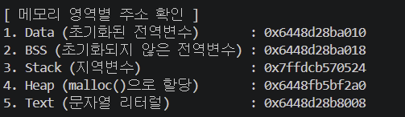

# Challenge1. 메모리 레이아웃 이해하기

# 문제

- 각 메모리 영역(Text, Data, BSS, Heap, Stack)에 데이터를 저장하는 코드를 직접 작성하고, gdb로 실제 주소를 확인해보기
- 아래 조건을 만족하는 코드를 직접 작성
    - 초기화된 전역변수 1개 (→ Data 영역)
    - 초기화되지 않은 전역변수 1개 (→ BSS 영역)
    - 지역변수 1개 (→ Stack 영역)
    - `malloc()`으로 할당한 변수 1개 (→ Heap 영역)
    - 문자열 리터럴 1개 (→ Text(Code) 영역)
- `gcc -g -O0`으로 컴파일 후 gdb로 열어서 아래 확인
    - 각 변수의 주소를 `printf`로 출력하여 주소 확인
    - gdb에서 해당 주소가 실제로 어느 영역에 속하는지 검증
    - (힌트) gdb에서 `info proc mappings` 명령어로 메모리 맵 확인 가능

# 풀이

#### 메모리 영역

- Text (Code) 영역: 실행할 프로그램의 기계어 코드와 읽기 전용(Read-Only) 데이터가 저장
- Data 영역: 프로그램 시작 시 할당되고 종료될 때 해제, 초기화된 전역 변수와 정적(static) 변수가 위치
- BSS 영역: 초기화되지 않은 전역 변수와 정적 변수가 저장, 공간 효율성을 위해 실행 시 운영체제가 자동으로 0으로 채워줌
- Heap 영역: 개발자가 런타임에 동적으로 메모리를 할당하고 해제하는 영역, 낮은 주소에서 높은 주소 방향으로 커짐
- Stack 영역: 함수 호출 시 생성되는 지역 변수나 리턴 주소 등이 저장, 높은 주소에서 낮은 주소 방향으로 커짐
    
    
    | 영역 (Segment) | 방향 | 설명 및 예시 코드 |
    | --- | --- | --- |
    | Stack | ↓ (낮은 주소로) | 함수 호출 시 생성되는 임시 데이터. (지역변수, 매개변수, 리턴 주소)
    예: `int main() { int local_var; ... }` |
    | .
    .
    . |  | (함수 호출 깊이에 따라 동적으로 크기 변화) |
    | (공유 
    라이브러리) |  | (프로그램에서 사용하는외부 `.so` / `.dll` 파일들이 로드되는 공간) |
    | .
    .
    . |  |  |
    | Heap | ↑ (높은 주소로) | 개발자가 직접 런타임에 할당/해제하는 동적 메모리.
    예: `int *ptr = (int*)malloc(sizeof(int));` |
    | BSS |  | 초기화되지 않은 전역/정적(static) 변수. 실행 시 0으로 초기화됨.
    예: `int global_uninit_var;` |
    | Data |  | 초기화된 전역/정적(static) 변수. 프로그램 시작 시 값이 존재함.
    예: `int global_init_var = 10;` |
    | Text (Code) |  | 프로그램 코드 자체와 수정 불가능한 읽기 전용(Read-Only) 데이터.
    예: `"Hello World"` 같은 문자열 리터럴 |

#### ASLR(Address Space Layout Randomization)

운영체제가 프로세스의 메모리 주소를 실행할 때마다 무작위로 배치하는 보안 기법

- 대표적으로 랜덤화되는 영역:
    - Stack
    - Heap
    - Shared Library(libc)
    - mmap 영역
    - PIE 실행파일 base address

#### 코드 작성

```c
#include <stdio.h>
#include <stdlib.h>

// 1. Data 영역: 초기화된 전역변수
int global_init_var = 100; 

// 2. BSS 영역: 초기화되지 않은 전역변수
int global_uninit_var;     

int main() {
    // 3. Stack 영역: 지역변수
    int local_var = 200;   

    // 4. Heap 영역: malloc()으로 할당한 변수
    int *heap_var = (int *)malloc(sizeof(int)); 
    *heap_var = 300;

    // 5. Text(Code) 영역: 문자열 리터럴 (Read-Only Data)
    char *text_literal = "Hello BCB!"; 

    // 각 변수의 주소 출력 (%p는 포인터 주소를 16진수로 출력)
    printf("\n[ 메모리 영역별 주소 확인 ]\n");
    printf("1. Data (초기화된 전역변수)       : %p\n", &global_init_var);
    printf("2. BSS (초기화되지 않은 전역변수) : %p\n", &global_uninit_var);
    printf("3. Stack (지역변수)               : %p\n", &local_var);
    printf("4. Heap (malloc()으로 할당)       : %p\n", heap_var); // 주의: 포인터 자체가 가리키는 힙 공간의 주소
    printf("5. Text (문자열 리터럴)           : %p\n", text_literal); // 주의: 문자열 리터럴이 존재하는 곳의 주소

    free(heap_var); // 동적 할당 해제
    
    // GDB에서 메모리 맵을 확인하기 위해 프로그램이 바로 종료되지 않도록 무한루프나 입력 대기를 걸어줌
    // 여기서는 getchar()를 사용해 입력을 기다리게 합니다.
    printf("\nGDB에서 'info proc mappings'를 확인하세요. 계속하려면 Enter를 누르세요.\n");
    getchar();

    return 0;
}
```

- 컴파일
    
    ```bash
    gcc -g -O0 challenge01.c -o challenge01
    ```
    
- 결과 확인
    
    
    

#### 디버깅

```bash
# GDB 실행 및 주소 확인
gdb ./challenge01

# 프로그램을 실행
run

# 메모리 맵 대조
info proc mappings
```

- 결과
    
    
    
    - mappings 읽는 법
        
        ```bash
        0x555555555000-0x555555556000 r-xp challenge01
        ```
        
        | 항목 | 의미 |
        | --- | --- |
        | 시작주소 | 0x555...5000 |
        | 끝주소 | 0x555...6000 |
        | r | 읽기 가능 |
        | w | 쓰기 가능 |
        | x | 실행 가능 |
        | p | private mapping |