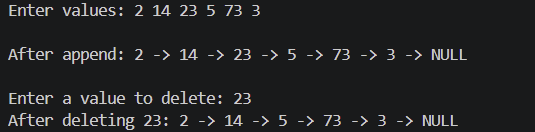

# Challenge1. 단순 연결리스트 구현

### 문제

- 포인터와 동적 할당을 활용해 단방향 연결리스트를 직접 구현
- 아래 조건을 만족하는 코드 작성
    - 노드 구조체 정의 (데이터 필드 + 다음 노드 포인터)
    - 노드 추가 함수 (append)
    - 노드 삭제 함수 (delete)
    - 전체 리스트 출력 함수 (print)
    - 사용한 노드는 반드시 free()로 해제
- 직접 구현한 연결리스트로 아래 시나리오 동작 확인
    1. 노드 5개 추가 후 전체 출력
    2. 중간 노드 1개 삭제 후 전체 출력
    3. 프로그램 종료 전 모든 노드 해제
- gdb로 노드 추가 시 Heap에 메모리가 할당되는 것 확인
    - 각 노드의 주소와 next 포인터가 가리키는 주소 출력해서 연결 구조 확인

### 풀이

#### 코드 구현

```c
#include <stdio.h>
#include <stdlib.h>

typedef struct Node {
    int data;            // data field
    struct Node* next;   // pointer that pointing next node
} Node;

void append(Node** head, int data) {
    Node* new_node = (Node*)malloc(sizeof(Node));

    new_node->data = data;  
    new_node->next = NULL;  

    if (*head == NULL)
        *head = new_node;
    else {
        Node* cur = *head;          
        while (cur->next != NULL)   
            cur = cur->next;
        cur->next = new_node;     
    }
}

void delete(Node** head, int target) {
    if (*head == NULL)
        return;

    if ((*head)->data == target) {
        Node* tmp = *head;       
        *head = (*head)->next;    
        free(tmp);                
        return;
    }

    Node* prev = *head;
    Node* cur = (*head)->next;
    while (cur != NULL) {
        if (cur->data == target) {
            prev->next = cur->next;
            free(cur);
            return;
        }
        prev = cur;
        cur = cur->next;
    }
}

void print_list(Node* head) {
    Node* cur = head;          
    while (cur != NULL) {      
        printf("%d -> ", cur->data);
        cur = cur->next;       
    }
    printf("NULL\n");         
}

void free_list(Node** head) {
    Node* cur = *head;
    while (cur != NULL) {
        Node* next = cur->next;  
        free(cur);             
        cur = next;            
    }
    *head = NULL;               
}

int main(void) {
    Node* head = NULL;
    char line[256];

    printf("Enter values separated by spaces, then press Enter: ");
    fgets(line, sizeof(line), stdin);

    char* p = line;
    int value, consumed;
    while (sscanf(p, "%d%n", &value, &consumed) == 1) {
        append(&head, value);
        p += consumed;
    }
    printf("\nAfter append: ");
    print_list(head);

    int target;
    printf("\nEnter a value to delete: ");
    fgets(line, sizeof(line), stdin);
    sscanf(line, "%d", &target);
    delete(&head, target);
    printf("After deleting %d: ", target);
    print_list(head);

    free_list(&head);

    return 0;
}
```

- 컴파일 및 실행
    
    ```c
    gcc -g -O0 -o Challenge01 Challenge01.c
    ```
    
- 결과 예시
    
    
    

#### GDB를 통한 Heap 할당 확인

```bash
break delete
continue          ← 삭제값 30 입력
print *head
print *(*head)->next
print *(*head)->next->next
print *(*head)->next->next->next
print *(*head)->next->next->next->next
```

