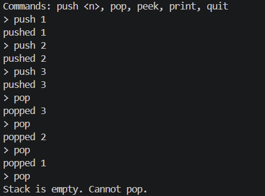

# Challenge2. 스택 구현

### 문제

- 연결리스트를 기반으로 스택(LIFO) 자료구조를 직접 구현
- 아래 조건을 만족하는 코드 작성
    - push(int data) - 스택에 데이터 추가
    - pop() - 스택에서 데이터 꺼내기 (빈 스택 예외 처리 포함)
    - peek() - 스택 top 값 확인 (꺼내지 않고)
    - print_stack() - 현재 스택 전체 출력
- 아래 시나리오 동작 확인
    1. push(1), push(2), push(3) 후 전체 출력
    2. pop() 두 번 후 전체 출력
    3. 빈 스택에서 pop() 했을 때 처리 확인

### 풀이

```c
#include <stdio.h>
#include <stdlib.h>

typedef struct Node {
    int data;
    struct Node* next;
} Node;

Node* top = NULL;

void push(int data) {
    Node* new_node = (Node*)malloc(sizeof(Node));
    new_node->data = data;
    new_node->next = top;
    top = new_node;
}

int pop(void) {
    if (top == NULL) {
        printf("Stack is empty. Cannot pop.\n");
        return -1;
    }
    Node* tmp = top;
    int value = tmp->data;
    top = top->next;
    free(tmp);
    return value;
}

int peek(void) {
    if (top == NULL) {
        printf("Stack is empty. Nothing to peek.\n");
        return -1;
    }
    return top->data;
}

void print_stack(void) {
    Node* cur = top;
    printf("top -> ");
    while (cur != NULL) {
        printf("%d -> ", cur->data);
        cur = cur->next;
    }
    printf("NULL\n");
}

void free_stack(void) {
    while (top != NULL) {
        Node* next = top->next;
        free(top);
        top = next;
    }
}

int main(void) {
    char line[256];
    char cmd[32];
    int value;

    printf("Commands: push <n>, pop, peek, print, quit\n");

    while (1) {
        printf("> ");
        if (fgets(line, sizeof(line), stdin) == NULL)
            break;

        if (sscanf(line, "%31s", cmd) != 1)
            continue;

        if (strcmp(cmd, "push") == 0) {
            if (sscanf(line, "%*s %d", &value) == 1) {
                push(value);
                printf("pushed %d\n", value);
            } else {
                printf("Usage: push <number>\n");
            }
        }
        else if (strcmp(cmd, "pop") == 0) {
            int v = pop();
            if (v != -1)
                printf("popped %d\n", v);
        }
        else if (strcmp(cmd, "peek") == 0) {
            int v = peek();
            if (v != -1)
                printf("top is %d\n", v);
        }
        else if (strcmp(cmd, "print") == 0) {
            print_stack();
        }
        else if (strcmp(cmd, "quit") == 0) {
            break;
        }
        else {
            printf("Unknown command: %s\n", cmd);
        }
    }

    free_stack();
    return 0;
}
```

#### 실행 결과

