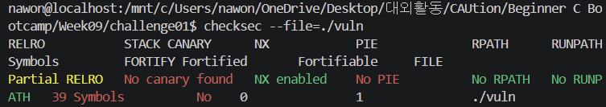
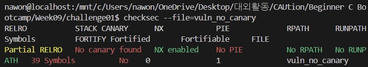

# Challenge2. checksec으로 보호 기법 확인

# 문제

- Challenge1에서 만든 바이너리에 checksec 실행
- checksec 설치 후 바이너리에 적용
- `fno-stack-protector` 옵션 유무에 따라 checksec 결과가 어떻게 달라지는지 비교
- checksec 으로 확인할 수 있는 정보는 무엇인지 조사

# 풀이

## 1. checksec 설치 및 바이너리 적용

```python
# 설치 명령어
sudo apt update
sudo apt install checksec

# 바이너리 점검 명령어
checksec --file=./vuln
```

실행 결과는 아래와 같다. 



## 2. -fno-stack-protector 옵션 유무에 따른 결과 비교

### 2.1. vuln_no_canary (옵션 제거 버전)

- 컴파일 명령어: `gcc -g -O0 -fno-stack-protector -no-pie -o vuln_no_canary vuln.c`
- checksec 결과:
    
    ```
    RELRO           STACK CANARY      NX            PIE            RPATH      RUNPATH
    Partial RELRO   No canary found   NX enabled    No PIE         No RPATH   No RUNPATH
    ```
    



### 2.2. vuln_with_canary (기본 보안 버전)

- 컴파일 명령어: `gcc -g -O0 -no-pie -o vuln_with_canary vuln.c`
- checksec 결과:
    
    ```
    RELRO           STACK CANARY      NX            PIE            RPATH      RUNPATH
    Partial RELRO   Canary found      NX enabled    No PIE         No RPATH   No RUNPATH
    ```
    


### 2.3. 차이

| 구분 | vuln_no_canary (옵션 있음) | vuln_with_canary (옵션 없음) |
| --- | --- | --- |
| 적용 옵션 | `-fno-stack-protector` | (옵션 제외 / GCC 기본 보안 작동) |
| checksec 결과 | No canary found | Canary found |
| 스택 내부 구조 | `buf` → `SFP` → `RET` | `buf` → `Canary(암호)` → `SFP` → `RET` |
| 공격 수행 결과 | 익스플로잇 성공
(`secret function...` 출력) | 공격 차단 및 강제 종료
(`stack smashing detected` 에러) |

## 3. checksec으로 확인할 수 있는 주요 보안 정보 조사

`checksec`은 바이너리에 적용된 핵심 메모리 보호 기법을 진단하는 도구로, 다음과 같은 5가지 보안 정보를 확인할 수 있다. 

- RELRO: 라이브러리 함수 주소가 저장되는 테이블 영역을 읽기 전용으로 만들어, 주소 조작 공격을 방어한다.
- STACK CANARY: 버퍼와 복귀 주소 사이에 비밀 무작위 값을 심어두어, 스택 버퍼 오버플로우 공격을 탐지하고 차단한다.
- NX: 데이터 저장 공간인 스택과 힙 영역에서 코드 실행 권한을 없애, 주입된 악성 쉘코드가 실행되지 않도록 막는다.
- PIE: 프로그램이 실행될 때마다 코드 주소를 무작위로 변경하여, 공격자가 타깃 함수의 메모리 주소를 예측하지 못하게 만든다.
- RPATH / RUNPATH: 라이브러리를 불러오는 경로가 내부에 고정되어 있는지 확인하여, 가짜 라이브러리가 삽입되는 취약점을 방지한다.