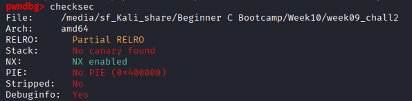

# Challenge1. pwndbg 설치 및 사용법 익히기

# 문제

- gdb의 플러그인인 pwndbg를 설치하고 기본 사용법 익히기
- pwndbg 설치 후 9주차 Challenge2 바이너리를 pwndbg로 열기
- 아래 pwndbg 전용 명령어를 직접 사용해보기
    - checksec : 보호 기법 확인
    - stack : 현재 스택 상태 시각화
    - disassemble, nearpc : 현재 실행 위치 주변 어셈블리 확인

# 풀이

## 1. 파일 준비

지난 소스 코드는 아래와 같다. 

```c
#include <stdio.h>

void secret() {
    printf("secret function called!\n");
}

void vuln() {
    char buf[16];
    gets(buf);
}

int main() {
    vuln();
    return 0;
}
```

해당 파일을 저장한 후, 아래와 같이 컴파일한다. 

```bash
gcc -g -O0 -fno-stack-protector 
	/ -no-pie -std=gnu89 -o 
	/ [저장할 파일명] [소스 코드 파일명]
```

- 옵션 설명

| 옵션 | 의미 |
| --- | --- |
| -g | gdb에서 소스 코드, 변수명, 줄번호 확인 가능하도록 디버깅 정보 포함 |
| -O0 | 컴파일러 최적화 없음 → 코드 흐름이 소스 그대로 유지됨 |
| -fno-stack-protector | 스택 카나리 보호 비활성화 → 버퍼 오버플로우 탐지 안 됨 |
| -no-pie | PIE 비활성화 → 함수 주소가 실행할 때마다 고정됨 |
| -std=gnu89 | C89 표준 사용 → gets()가 표준에서 제거되기 전 버전이라 컴파일 가능 |

## 2. pwndbg 설치

```bash
# 의존성 설치
sudo apt-get update
sudo apt-get install -y git python3 python3-pip

# pwndbg 클론 및 설치
git clone https://github.com/pwndbg/pwndbg
cd pwndbg
./setup.sh
```

설치 후, gdb를 열면 프롬프트가 `(gdb)` 에서 `pwndbg>` 로 바뀐다. 

## 3. pwndbg 명령어 실습

### 3.1. `checksec` — 보호 기법 확인



각 항목의 의미는 아래와 같다. 

| 항목 | 결과 | 의미 |
| --- | --- | --- |
| RELRO | Partial | GOT 테이블 일부만 보호. Full이면 GOT 덮어쓰기 공격 불가 |
| Stack Canary | No canary found | 스택 오버플로우 탐지 장치 없음 → 버퍼 오버플로우 공격 가능 |
| NX | NX enabled | 스택/힙 영역에서 코드 실행 불가 → 셸코드를 스택에 올려도 실행 안 됨 |
| PIE | No PIE | 바이너리가 고정 주소에 로드됨 → `secret()` 같은 함수 주소가 항상 동일 |

⇒ No canary + No PIE 이므로 버퍼 오버플로우를 일으켜, ret address를 `secret()` 주소로 덮는 공격이 가능하다. 

### 3.2. 브레이크포인트 설정 및 실행


### 3.3 `nearpc` — 현재 실행 위치 주변 어셈블리


`►` 가 현재 실행 위치(RIP)를 나타낸다.

현재 `main+4`에서 멈춰 있고, 다음에 `vuln()`을 호출할 것임을 알 수 있다. 

### 3.4. `disassemble` — 함수 전체 어셈블리


### 3.5 `stack` — 스택 상태 시각화


읽는 법:

- 각 행은 8바이트(64비트 한 칸)
- `—▸` : 해당 주소에 저장된 값이 다른 주소를 가리키는 포인터
- `◂—` : 해당 주소에 저장된 리터럴 값
- `rbp rsp` 표시 → 현재 RSP와 RBP가 같은 위치(main 프롤로그 직후)
- `01` 행의 `__libc_start_call_main+119` → main이 끝나면 돌아갈 ret address